```
Nom : SILLIAU
Prénom : Kévin
Groupe : 2C1
```

# Compte-rendu projet SAÉ DevCloud

## Version 1 : PHP & SQLite

> La version 1 du projet consistait à reprendre le site web que nous avions conçu l'année dernière dans la SAÉ23 afin d'y implémenter plusieurs choses à travers différentes versions.
> Dans cette version, il fallait déploier simplement l'application avec un Dockerfile et piloter le code source sur le [Gitlab](https://gitlab.com/Zowlak/saedev) du projet.

> **Version 1 disponible sur Gitlab [ici](https://gitlab.com/Zowlak/saedev/-/tree/main/V1)**

> **Il existait déjà une table "comptes" dans la base de données pour des comptes ayant des droits (admin) et des comptes sans droits (clients ou vendeurs) :**  
> 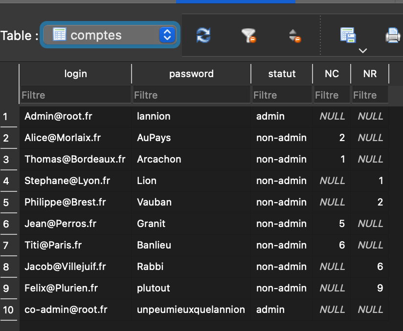

> **Dockerfile de la Version 1 :**

```Dockerfile
#On importe l'image du serveur PHP
FROM php:8.1-apache
#On définit le répertoire courant
WORKDIR /var/www/html
#On copie notre projet dans le répertoire courant
copy app/ .
#On créé un volume pour la persistance des données
VOLUME /var/www/html/bdd
#On ajoute les permissions nécessaires pour la sécurité
RUN chown www-data /var/www/html -R
RUN chgrp www-data /var/www/html -R
#On installe les packages nécessaires pour le traitement de la BDD SQLite
RUN apt-get update -y && apt-get upgrade -y
RUN apt-get install sqlite3
#Et on définit le port pour docker
EXPOSE 80
```

> **Pour déploier l'application, après avoir télécharger le dossier "saedev" via le repo Gitlab :**

> • 1 - Se mettre dans le dossier "V1" :

```bash
cd V1
```

> • 2 - Construire l'image Docker :

```bash
docker build -t version1 .
```

> • 3 - Déploier l'image Docker :

```bash
docker run -dit --name V1 -v CheminAuDossierV1/app/bdd/:/var/www/html/bdd -p 8000:80 version1
```

> • 4 - Se rendre sur le site :

```bash
Adresse : http://localhost:8000/
```

> **Ce qui donne si on test :**

> **Accès au site :**  
>   
> **On peut se connecter, ici avec un compte admin par exemple :** > 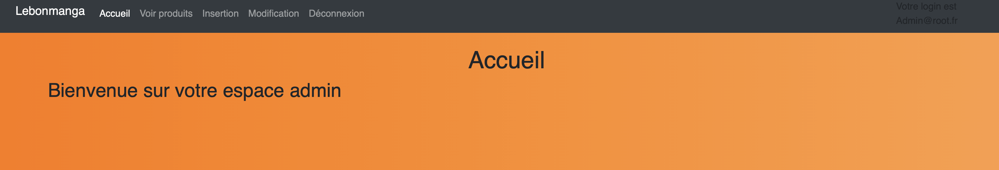  
> **La recherche des produits fonctionne (avec tri dispo) :**  
>   
> **On peut insérer un client ou un vendeur :**  
> 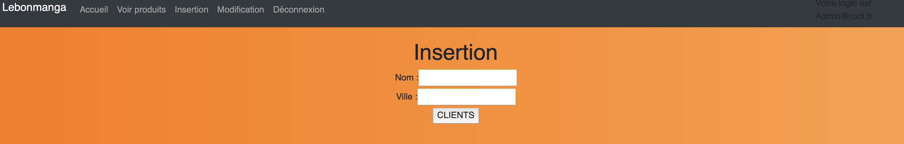  
> 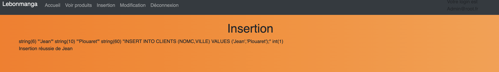  
> **Et on peut modifier un produit :**  
> 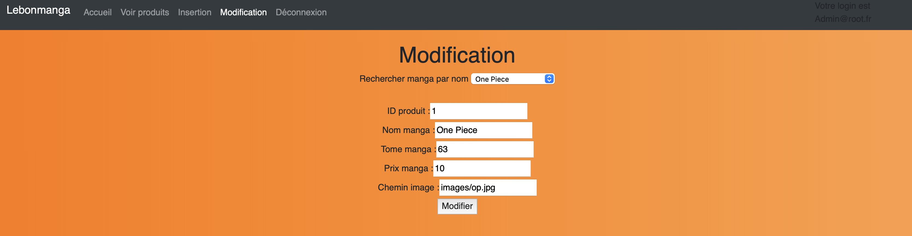  
> 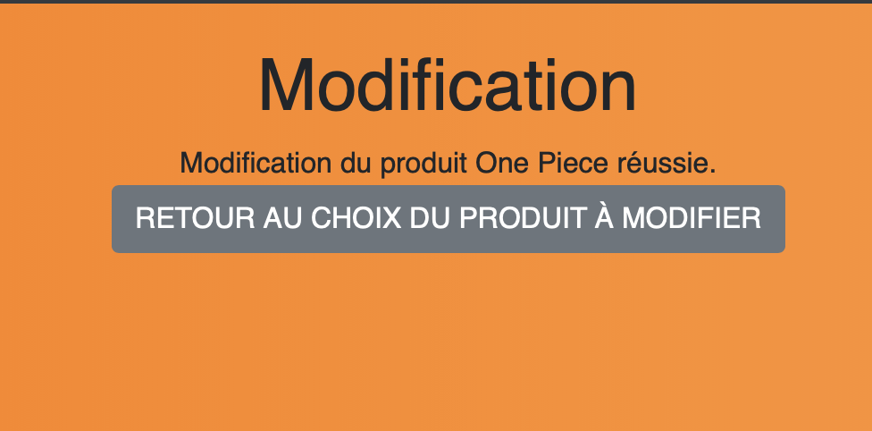  
> **Ici on peut constater que la modification a bien eu lieu :** > 

> **Ainsi on voit donc que tous les fonctionnalités du site sont présentes et fonctionnelles.**

## Version 2: PHP & PostgreSQ

> Pour cette version 2, nous devions remplacer notre base de donnée SQLite par une base de donnée PostgreSQL et déploier notre application à l'aide de deux Dockerfile : l'un pour l'application web, l'autre pour la base de données.

> **Version 2 disponible sur Gitlab [ici](https://gitlab.com/Zowlak/saedev/-/tree/main/V2)**

> **Dockerfile de la Version 2 - Application PHP :**

```Dockerfile
#On importe l'image du serveur PHP
FROM php:8.1-apache
#On définit le répertoire courant
WORKDIR /var/www/html
#On met à jour le serveur et ses paquets
RUN apt-get update -y && apt-get upgrade -y
#On installe les packages nécessaires pour le traitement de la BDD Postgre
RUN apt-get install -y libpq-dev && docker-php-ext-install pdo pdo_pgsql
#On copie notre projet dans le répertoire courant
COPY app/ .
#On ajoute les permissions nécessaires pour la sécurité
RUN chown www-data /var/www/html -R
RUN chgrp www-data /var/www/html -R
#Et on définit le port pour docker
EXPOSE 80
```

> **Dockerfile de la Version 2 - Base de données PostgreSQL :**

```Dockerfile
#On importe l'image "postgres"
FROM postgres
#On définie ses variables d'environnement pour la BDD
ENV POSTGRES_PASSWORD 'lannion'
ENV POSTGRES_USER 'dockerpg'
ENV POSTGRES_DB 'lebonmanga'
ENV PGDATA /var/lib/postgresql/data
#On expose le container sur le port 5432
EXPOSE 5432
#On copie nos fichiers vers le point d'entrée
COPY initData/ docker-entrypoint-initdb.d
#Et on lance la bDD
CMD ["docker-entrypoint.sh", "postgres"]
```

> **Pour déploier l'application, après avoir télécharger le dossier "saedev" via le repo Gitlab :**

> • 1 - Se mettre dans le dossier "V2" :

```bash
cd V2
```

> • 2 - Construire & lancer le containeur pour le site web :

```bash
cd web
docker build -t image_web .
docker run -dit --name V2Web -p 8000:80 image_web
```

> • 3 - Puis construire & lancer le containeur pour la base de données PostgreSQL :

```bash
cd ../bdd
docker build -t image_bdd .
docker run -dit --name V2BDD image_bdd
```

> • 4 - Se rendre sur le site :

```bash
Adresse : http://localhost:8000/
```

> **Ce qui donne si on test :**

> **Accès au site :**  
>   
> **On peut se connecter, ici avec un compte admin par exemple :**  
> 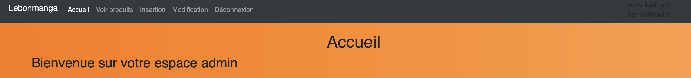  
> **La recherche des produits fonctionne (avec tri dispo) :**  
>   
> **On peut insérer un client ou un vendeur :**  
>   
> 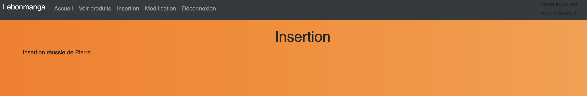  
> **Et on peut modifier un produit :**  
> 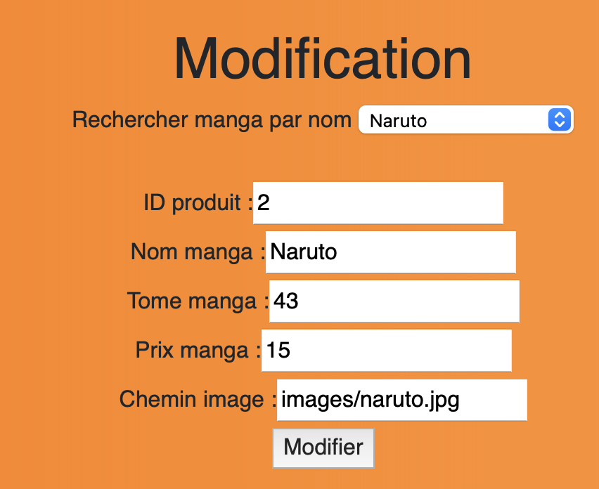  
> 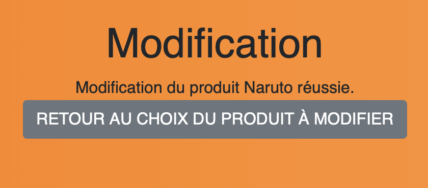  
> **Ici on peut constater que la modification a bien eu lieu :**  
> 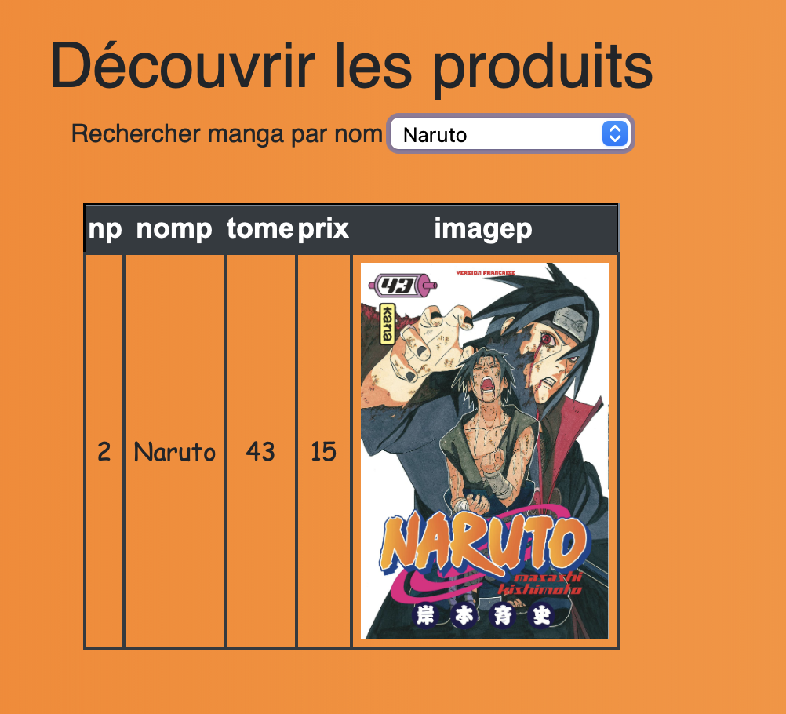

> **Ainsi on voit donc que tous les fonctionnalités du site sont présentes et fonctionnelles.**

## Version 3: PHP & PostgreSQL & API Python

> Pour cette version, nous devions développer une API en Python avec FastAPI pour réaliser des opérations CRUD sur notre base de donnée et ensuite l'implémenter pour pouvoir l'appeler et l'utiliser depuis notre application web en PHP.

> **Version 3 disponible sur Gitlab [ici](https://gitlab.com/Zowlak/saedev/-/tree/main/V3)**

> **Docker compose du projet :**

**ATTENTION :** Le docker compose ci-dessous est fait avec les chemins d'accès vers les fichiers de mon PC, il faudra donc penser à les modifier pour mettre le chemin d'accès vers là où vous avez télécharger le projet si vous souhaitez le déploier.

```Dockerfile
version: "3.8"
networks:
  monreseau:
    ipam:
      driver: default
      config:
        - subnet: 172.20.0.0/24 #Réseau de l'application
services:
  web: # Service de l'application web
    build:
      context: /Users/zowlak/Desktop/Cours/SAEDev/Projet/gitlab/saedev/V3/web # dossier du service
      dockerfile: Dockerfile # l'image se construit à partir du Dockerfile précédemment créé
    container_name: V3Web # Nom du container
    ports:
      - 9000:80 # 'porthote:portcontainer'
    networks:
      monreseau:
        ipv4_address: 172.20.0.2 # Adresse IP du container
  db: # Service de la base de données PostgreSQL
    build:
      context: /Users/zowlak/Desktop/Cours/SAEDev/Projet/gitlab/saedev/V3/bdd # dossier du service
      dockerfile: Dockerfile # l'image se construit à partir du Dockerfile précédemment créé
    container_name: V3BDD # Nom du container
    ports:
      - 5432:5432 # 'porthote:portcontainer'
    networks:
      monreseau:
        ipv4_address: 172.20.0.3 # Adresse IP du container
  api: # Service de l'API
    build:
      context: /Users/zowlak/Desktop/Cours/SAEDev/Projet/gitlab/saedev/V3/api/ # dossier du service
      dockerfile: Dockerfile # L'image se construit à partir du Dockerfile situé ci-dessous
    container_name: V3API # Nom du container
    ports:
      - 8000:8000 # 'porthote:portcontainer'
    networks:
      monreseau:
        ipv4_address: 172.20.0.4 # Adresse IP du container
```

> **Dockerfile de l'API :**

```Dockerfile
FROM python:3.8.13-bullseye

WORKDIR /code

COPY ./requirements.txt /code/requirements.txt
RUN pip install --no-cache-dir --upgrade -r /code/requirements.txt
COPY ./app /code/app

CMD ["uvicorn", "app.main:app", "--host", "0.0.0.0", "--port", "8000"]
```

> **Contenu du fichier "requirements.txt" :**

```
fastapi == 0.92.0
pydantic == 1.10.6
uvicorn == 0.20.0
psycopg2==2.9.3
```

> **API Python réalisée avec FastAPI :**

```python
from http.client import HTTPException
import os
from fastapi import FastAPI
from pydantic import BaseModel
import sqlite3
import psycopg2

app = FastAPI()

class Produit(BaseModel):
    nomp: str
    tome: int
    prix: int
    imagep: str

def get_db_connection():
    conn = psycopg2.connect(database="lebonmanga", user='dockerpg', password='lannion', host='172.20.0.3', port= '5432')
    return conn

@app.get("/produits")
async def get_produits():
    try:
        with get_db_connection() as conn:
            cur = conn.cursor()
            cur.execute("SELECT * FROM produits")
            data = cur.fetchall()
        if not data:
            raise HTTPException(status_code=404, detail="Erreur")
    except psycopg2.Error as error:
        print("Erreur psycopg2", error)
    return data

@app.put("/produits/modifier")
async def put_produits(produit: Produit):
    try:
        with get_db_connection() as conn:
            cur = conn.cursor()
            cur.execute("UPDATE produits SET nomp = %s, tome = %s, prix = %s, imagep = %s WHERE nomp = %s",
                        (produit.nomp, produit.tome, produit.prix, produit.imagep, produit.nomp))
            conn.commit()
        if not produit:
            raise HTTPException(status_code=404, detail="Erreur")
    except psycopg2.Error as error:
        print("Erreur psycopg2", error)
    finally:
      if conn:
          conn.close()
          print("Connexion fermée")
    return produit

@app.post("/produits/creer")
async def post_produits(produit: Produit):
    try:
        with get_db_connection() as conn:
            cur = conn.cursor()
            cur.execute("INSERT INTO produits(nomp, tome, prix, imagep) VALUES(%s, %s, %s, %s)",
                    (produit.nomp, produit.tome, produit.prix, produit.imagep))
            conn.commit()
        if not produit:
            raise HTTPException(status_code=404, detail="Erreur")
    except psycopg2.Error as error:
        print("Erreur psycopg2", error)
    finally:
        if conn:
            conn.close()
            print("Connexion fermée")
    return produit

@app.delete("/produits/supprimer")
async def delete_produits(produit: Produit):
    try:
        with get_db_connection() as conn:
            cur = conn.cursor()
            cur.execute("DELETE FROM produits WHERE nomp = %s AND tome = %s AND prix = %s AND imagep = %s",
                    (produit.nomp, produit.tome, produit.prix, produit.imagep))
            conn.commit()
        if not produit:
            raise HTTPException(status_code=404, detail="Erreur")
    except psycopg2.Error as error:
        print("Erreur psycopg2", error)
    finally:
        if conn:
            conn.close()
            print("Connexion fermée")
    return "OK"
```

> **Pour déploier l'application, après avoir télécharger le dossier "saedev" via le repo Gitlab :**

> • 1 - Se mettre dans le dossier "V3" :

```bash
cd V3
```

> • 2 - Construire & lancer les containeurs avec Docker Compose :

```bash
docker compose up --build
```

> • 3 - Se rendre sur le(s) site(s) :

```bash
Adresse Serveur Web : http://localhost:9000/
Adresse FastAPI : http://localhost:8000/docs
```

> **Exemple de l'utilisation de l'API et ses opérations CRUD avec FastAPI :**  
> 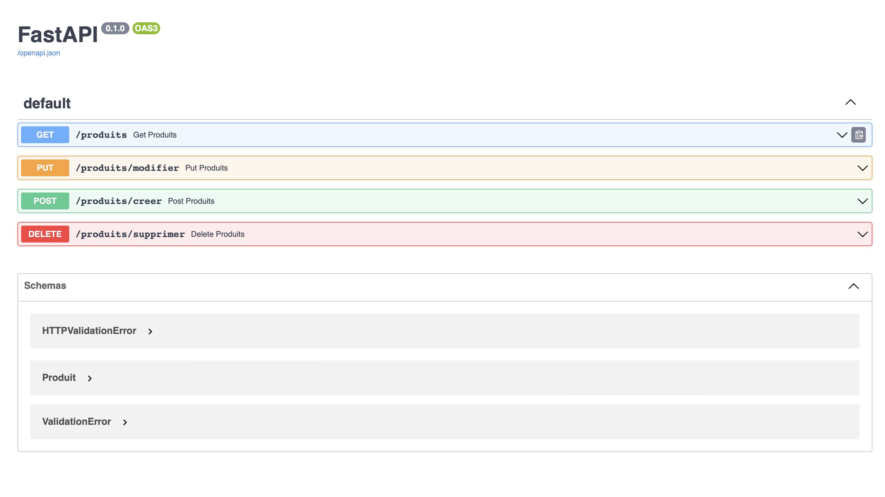

> **Requête "GET" :**  
> 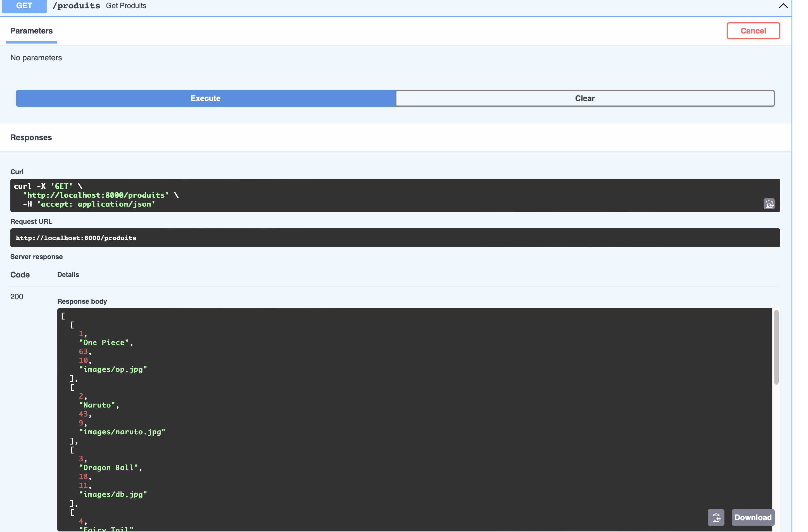  
> **Requête "POST" :**  
> 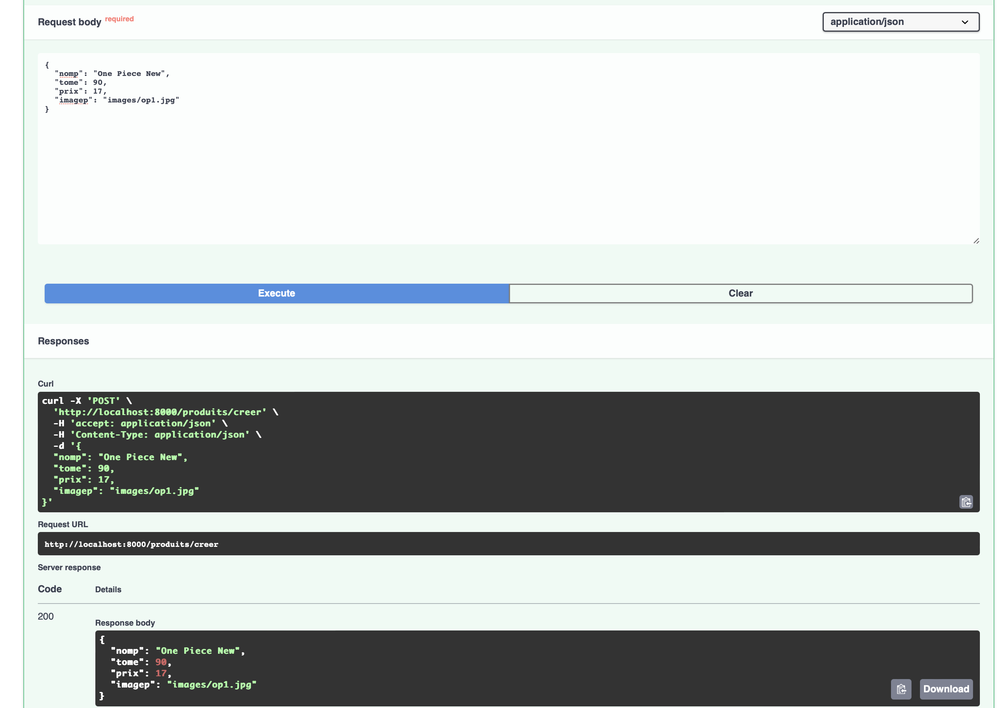  
> **Et si on va sur l'application web vérifier que le produit à été créé, il s'y trouve :**  
>   
> **Requête "PUT" :**  
> 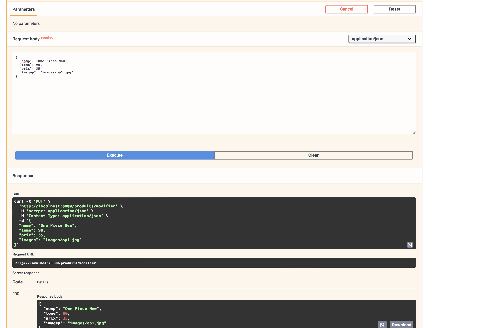  
> **Et si on va sur l'application web vérifier, le prix a bien été modifié à 35 :**  
>   
> **Requête "DELETE" :**  
> 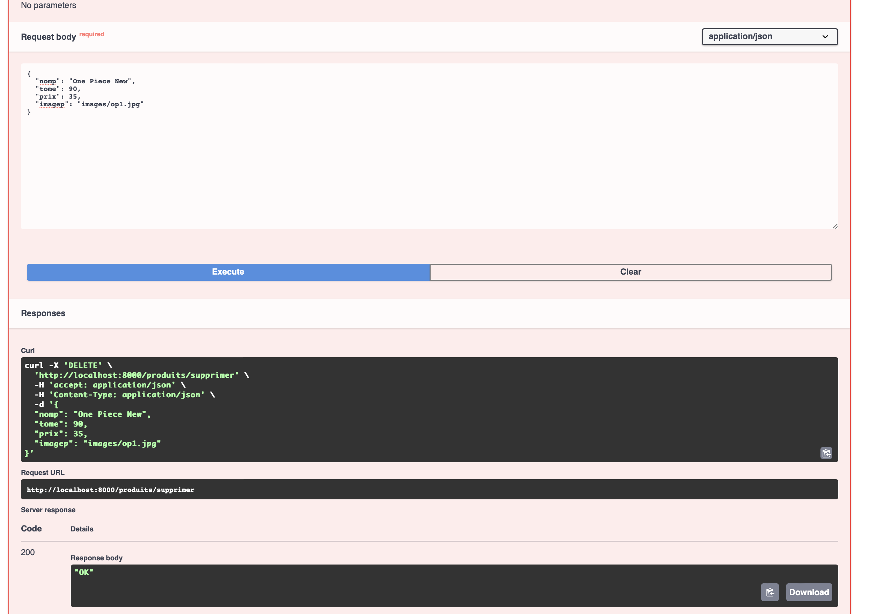  
> **Et si on va sur l'application web vérifier, il n'y est plus dans la liste :**  
> 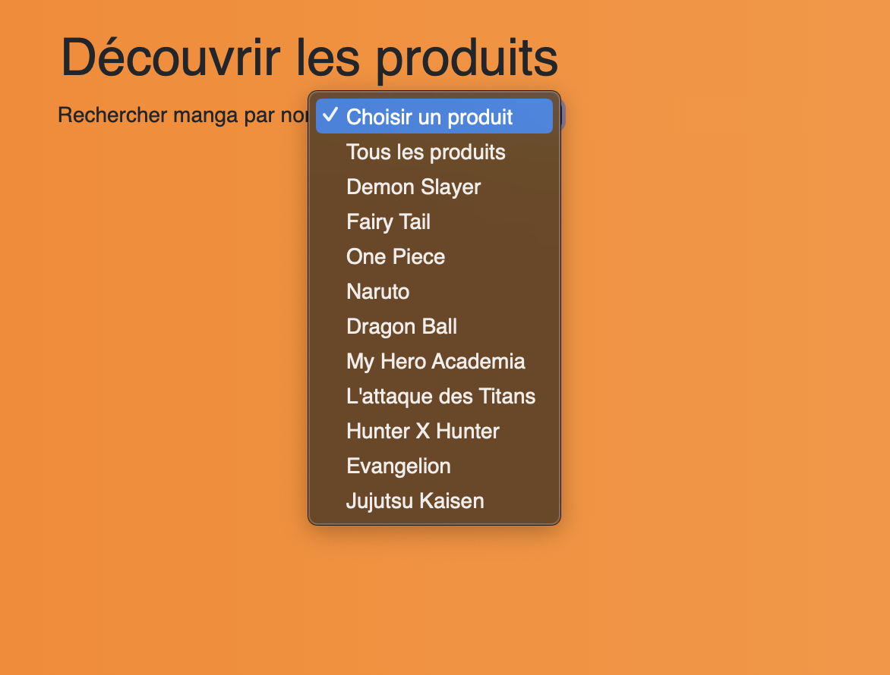

> **Pour l'utilisation de l'API directement via PHP avec Curl, voici deux exemples :**

> **Utilisation de la requête CRUD "GET" de l'API pour lister tous les produits :**  
>   
> **Code de la fonction :**

```php
function afficherTous(){
		// Fonction qui permet de récupérer tous les produits de la base de données
		$retour=0;
		$requete = CallAPI('GET', 'http://172.20.0.4:8000/produits', false);
		$retour = json_decode($requete, true);
		return $retour;
}
```

> **Qui appelle la fonction "CallAPI" utilisant Curl :**

```php
function CallAPI($method, $url, $data = false){
			$curl = curl_init();

			switch ($method)
			{
					case "POST":
							curl_setopt($curl, CURLOPT_POST, 1);

							if ($data)
									curl_setopt($curl, CURLOPT_POSTFIELDS, $data);
							break;
					case "PUT":
							curl_setopt($curl, CURLOPT_CUSTOMREQUEST, "PUT");

							if ($data)
									curl_setopt($curl, CURLOPT_POSTFIELDS, $data);
							break;
					default:
							if ($data)
									$url = sprintf("%s?%s", $url, http_build_query($data));
			}

			curl_setopt($curl, CURLOPT_URL, $url);
			curl_setopt($curl, CURLOPT_RETURNTRANSFER, 1);

			$result = curl_exec($curl);

			curl_close($curl);

			return $result;
}
```

> **Et un autre exemple avec la modification d'un produit en utilisant l'API via Curl :**  
> **Ici on modifie le tome, l'image et le prix en passant de 63, prix de 10 et l'image du tome 63 au tome 90, prix de 89 et image du tome 90 :**  
> 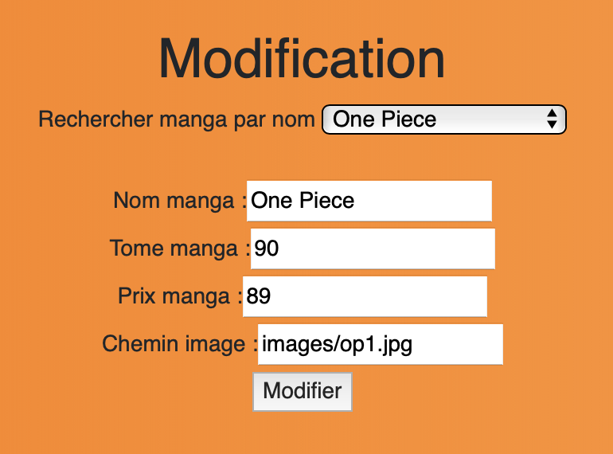  
> 

> **Code de l'appel de l'API en PHP avec CURL sans utiliser la fonction CallAPI cette fois-ci :**

```php
function ModifProduit($NOMP, $TOME, $PRIX, $IMAGE){
	//Fonction permettant de modifier un produit dans la BDD
	$retour = 0;

	$TOME = (int)($TOME);
	$PRIX = (int)($PRIX);

	$data = array(
		'nomp' => $NOMP,
		'tome' => $TOME,
		'prix' => $PRIX,
		'imagep' => $IMAGE
	);

	$ch = curl_init();
    curl_setopt($ch, CURLOPT_URL, "http://172.20.0.4:8000/produits/modifier");
    curl_setopt($ch, CURLOPT_CUSTOMREQUEST, "PUT");
    curl_setopt($ch, CURLOPT_HTTPHEADER, array("Content-Type: application/json"));
    curl_setopt($ch, CURLOPT_POSTFIELDS, json_encode($data));
    curl_setopt($ch, CURLOPT_RETURNTRANSFER, true);
    $response = json_decode(curl_exec($ch));
    curl_close($ch);

	$retour = 1;

	return $retour;
}
```
